**Visual story telling part 1: Green buildings**
------------------------------------------------

### **Problem**

An Austin real-estate developer is interested in the possible economic
impact of “going green” in her latest project: a new 15-story mixed-use
building on East Cesar Chavez, just across I-35 from downtown. Will
investing in a green building be worth it, from an economic perspective?
The baseline construction costs are $100 million, with a 5% expected
premium for green certification.

The developer has had someone on her staff, who’s been described to her
as a “total Excel guru from his undergrad statistics course,” run some
numbers on this data set and make a preliminary recommendation. Here’s
how this person described his process:

> I began by cleaning the data a little bit. In particular, I noticed
> that a handful of the buildings in the data set had very low occupancy
> rates (less than 10% of available space occupied). I decided to remove
> these buildings from consideration, on the theory that these buildings
> might have something weird going on with them, and could potentially
> distort the analysis. Once I scrubbed these low-occupancy buildings
> from the data set, I looked at the green buildings and non-green
> buildings separately. The median market rent in the non-green
> buildings was $25 per square foot per year, while the median market
> rent in the green buildings was $27.60 per square foot per year: about
> $2.60 more per square foot. (I used the median rather than the mean,
> because there were still some outliers in the data, and the median is
> a lot more robust to outliers.) Because our building would be 250,000
> square feet, this would translate into an additional $250000 x 2.6 =
> $650000 of extra revenue per year if we build the green building.

> Our expected baseline construction costs are $100 million, with a 5%
> expected premium for green certification. Thus we should expect to
> spend an extra $5 million on the green building. Based on the extra
> revenue we would make, we would recuperate these costs in
> $5000000/650000 = 7.7 years. Even if our occupancy rate were only 90%,
> we would still recuperate the costs in a little over 8 years. Thus
> from year 9 onwards, we would be making an extra $650,000 per year in
> profit. Since the building will be earning rents for 30 years or more,
> it seems like a good financial move to build the green building.

> Goal: The developer listened to this recommendation, understood the
> analysis, and still felt unconvinced. She has therefore asked you to
> revisit the report, so that she can get a second opinion.

### **Steps taken**

-   Visualized the data to identify confounding variables affecting rent
-   Visualized the data to arrive at the precise numbers that can be
    used for calculations

### **Visualizations**

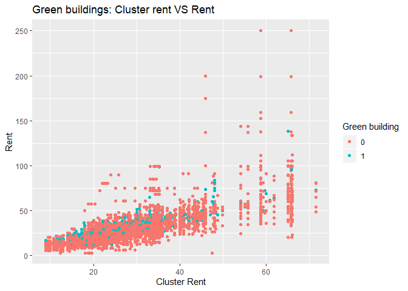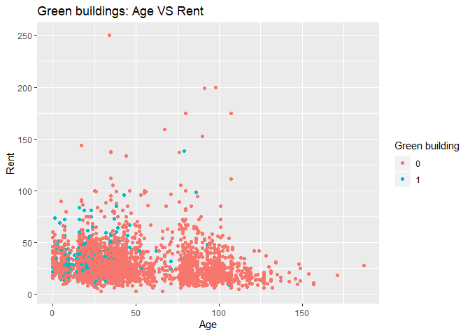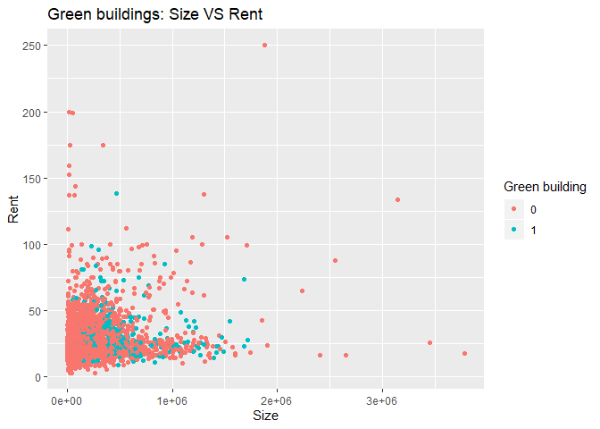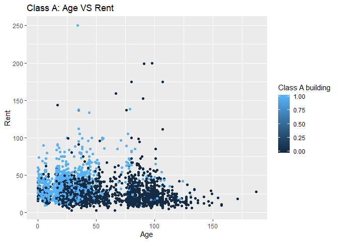
**Observations**

-   Rent is correlated with the cluster rent
-   Rent is correlated with the size, as expected
-   Most of the class A buildings are also younger
-   Age does not have a high correlation with rent
-   Class a buildings get higher rent as they are premium buildings

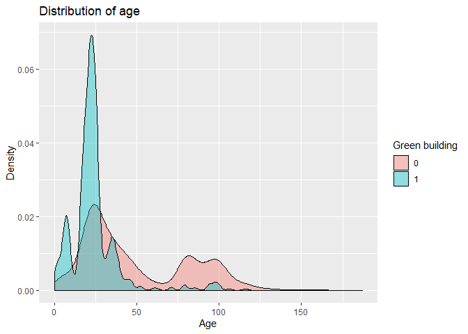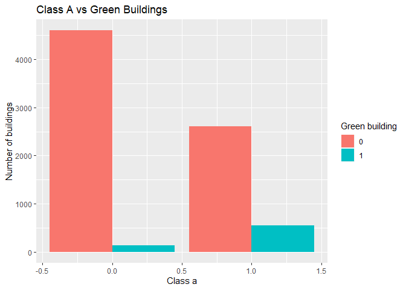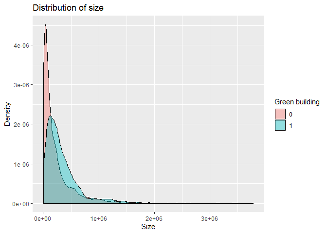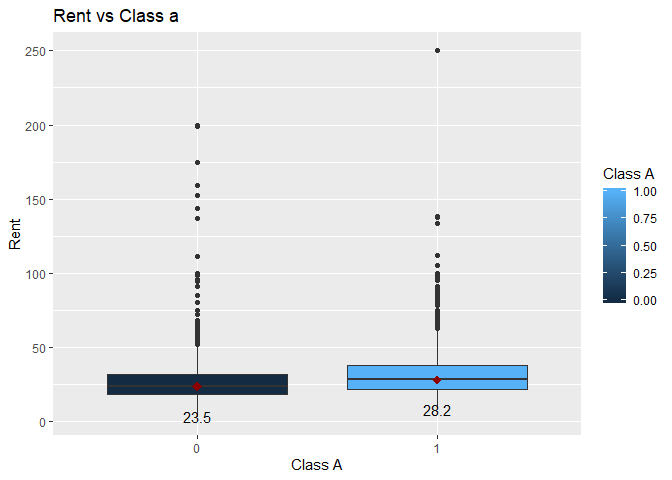
**Observations**

-   Most of the green buildings are younger than non-green buildings
-   The proportion of class a buildings is higher in green buildings
-   The proportion of green and non-green building increases as the size
    of buildings increases
-   The is a significant difference in the of rent of class a and
    non-class a buildings

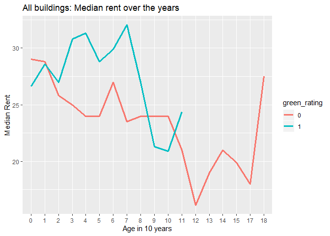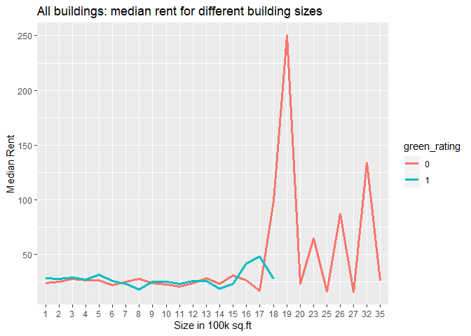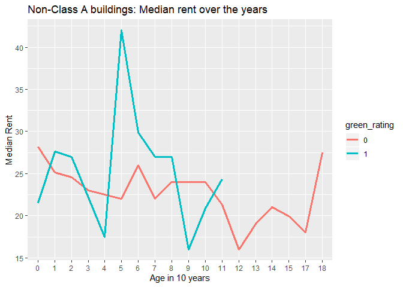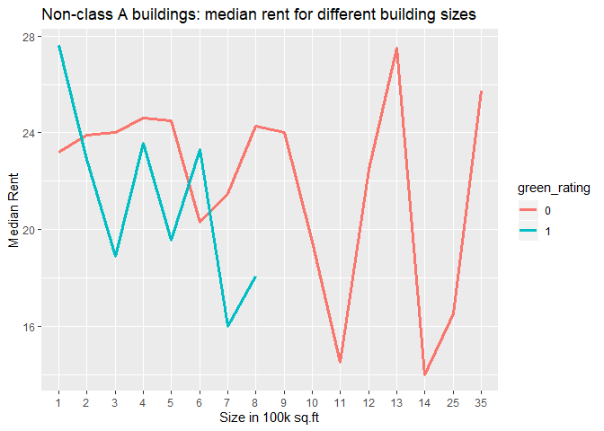

**Observations**

-   For a size of 250,000 sqft, the green buildings have a higher rent
    when it is a class a building
-   The rent of green buildings is lower than non-green ones when they
    are not class a buildings
-   The rent difference is not uniform across different sizes and ages

### **Insights and Recommendations**

We have seen that the analysis by stats guru is flawed since he fails to
account for all the factors that affect the rent. First, he used the
median rent of all buildings to calculate the returns. Hence he fails to
accout for other factors such as size and class of the buildings into
his analysis. For instance, we have seen that class a buildings will
yield a higher rent than non green buildings that are class a.

**Calculations**

-   The rent difference is not uniform across different sizes and age,
    so we cannot use a fixed difference in rent to calculate the returns
-   For the same reason, we should consider only the buildings that have
    sizes between 200k and 300k sq.ft
-   We should also use the median leasing rate of such buildings instead
    of 90% rate
-   The data provided does not have information about class a buildings
    with sizes ranging from 200k sq.ft to 300k sq.ft. So let’s use
    average 5 year return to arrive at final recommendations

**Final recommendation**

-   If the building is not a Class-A building, it is not wise to invest
    in a green building since the average returns for 5 years are
    negative
-   The builder should invest in a Class-A green building to yield
    positive returns
-   We can expect a occupancy rate of 91.6% on such buildings
-   The average difference in rent for green and non-green buildings
    that are class a and whose sizes ranging from 200k to 300k is 3.097
-   Hence, for a 250k sq.ft building at 91.6% occupancy, we expect to
    recuperate the costs in 7.05 years

**Visual story telling part 2: flights at ABIA**
------------------------------------------------

We have in hand, the ‘flight’ data during the year 2008 at Austin
airport. Let’s do some exploratory data analysis and try to isolate the
patterns/behaviour. We are looking at around 100k records of flight data
in 2008 here, primarily focussing on the air traffic and delays.

From the histograms of arrival and departure delays, its conclusive that
both are centred around a mean of ZERO. We are observing a similar trend
with a few outliers (values close to 500 minutes).

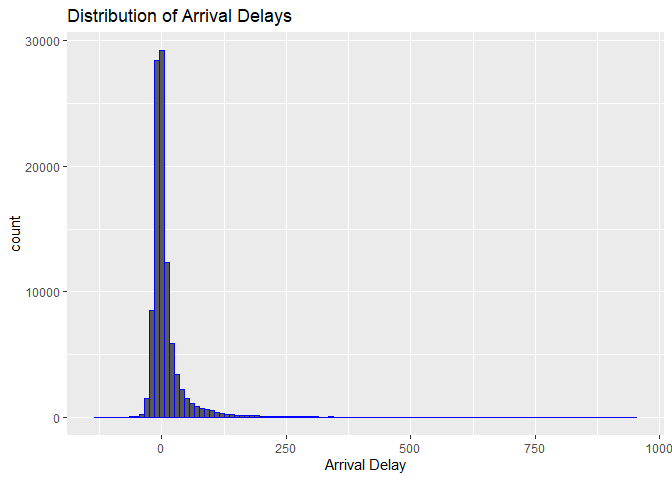

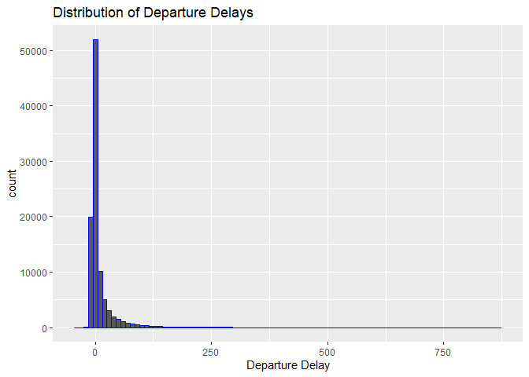

We will analyse the correlation between arrival and departure delays to
understand if any particular carrier is deviating from the normal
behaviour. For couple of carriers, there are a few outliers as expected
from the distribution plot. Almost perfect correlation between the
delays except for a few carriers who did compensate for the departure
delays(Arrival delay almost none for such observations).

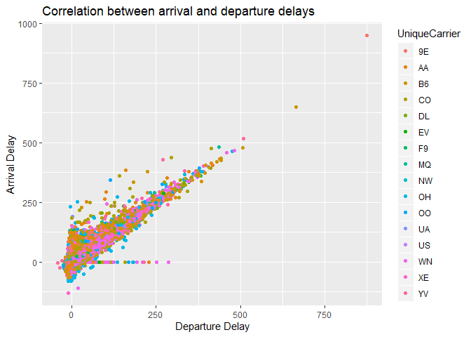

We will try to visualize the correlation for carriers individually.
Visually, the slope of the plots remain roughly constant, so NO carriers
are consistently making up for the departure delays.

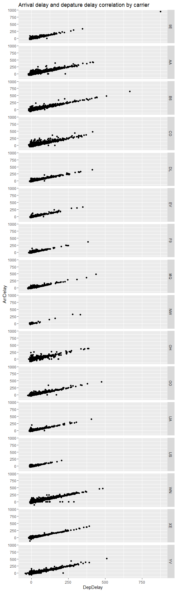

<table style="width:56%;">
<colgroup>
<col style="width: 55%" />
</colgroup>
<thead>
<tr class="header">
<th>Air carrier operation at Austin Airport</th>
</tr>
</thead>
<tbody>
<tr class="odd">
<td>Next we will shift our focus to the Carrier operation at Austin Airport. Southwest(WN) tops the list with almost 40k operations, followed by Alaskan Airlines(AA). Northwest Airlines(NW) has the fewest operations -121.</td>
</tr>
<tr class="even">
<td>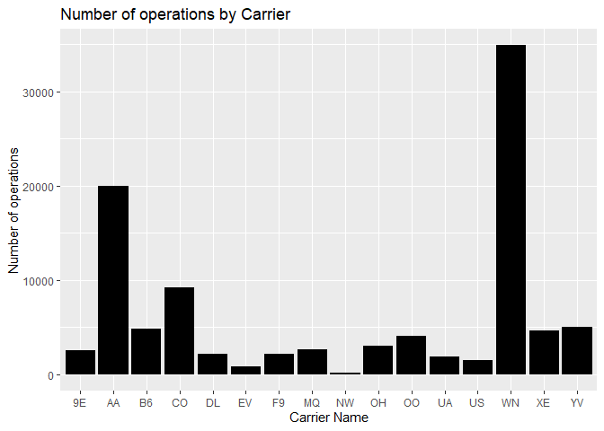</td>
</tr>
<tr class="odd">
<td>Lets try to find out which carrier you can trust the most before planning your next flight!</td>
</tr>
<tr class="even">
<td>According to the Probability of carrier delay in excess of 30 mins: 1. Southwest(WN) and Frontier Airlines(F9) have the lowest 2. YV and 9E have more than 60% chance. We observed a big outlier for 9E earlier, so could be one of the reason.</td>
</tr>
<tr class="odd">
<td>Reliable Carriers: Southwest(WN) seems to be the most reliable. Even with 40k operations, the avg carrier delay is just 18 mins. Avg departure delay is less than avg carrier delay. We have a few airlines – F9 MQ, US, WN and XE with less that 30% probability, but the # of operations are less. We feel Alaskan Airlines(AA) with close to 20k operations outperforms a lot of carriers with way fewer number of operations.</td>
</tr>
<tr class="even">
<td>Unreliable Carriers: 1. 9E and YV seems to have an avg carrier delay in excess of 1hr. 2. With just 121 operations, NW has a high avg carrier delay of 48 minutes.</td>
</tr>
<tr class="odd">
<td>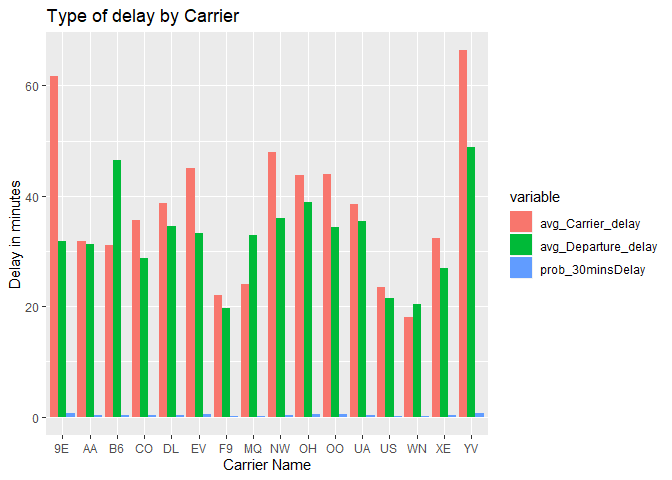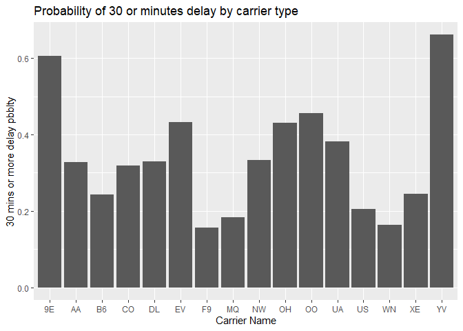</td>
</tr>
<tr class="even">
<td>Types of Delays encountered:</td>
</tr>
</tbody>
</table>

Most frequently occurring and total delay time in minutes- NAS Delay,
Late Aircraft and Carrier delay

Least- Security Delay

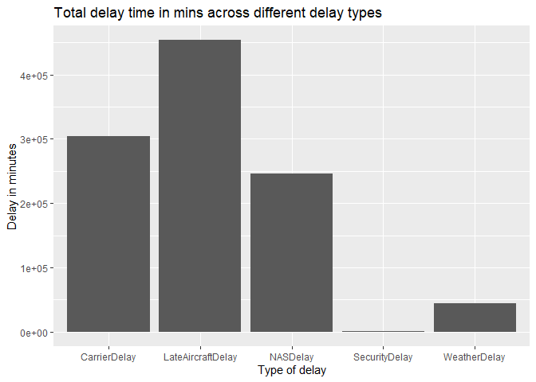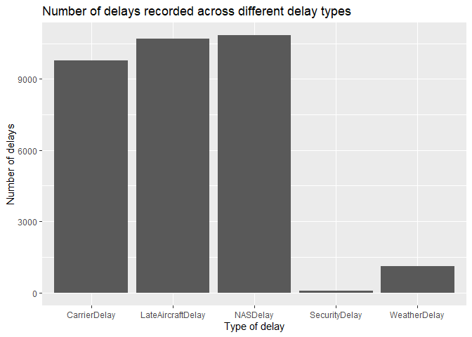

Delay of flights departing from Austin - month-wise split Sep, Oct and
Nov have the least

    ## # A tibble: 12 x 3
    ##    Month dep_delay arrdelay
    ##    <fct>     <dbl>    <dbl>
    ##  1 1         26593    20660
    ##  2 2         33638    25792
    ##  3 3         51801    47646
    ##  4 4         27112    26020
    ##  5 5         33996    26510
    ##  6 6         45401    50434
    ##  7 7         34364    28604
    ##  8 8         32277    25408
    ##  9 9          7745      -79
    ## 10 10        11606     4005
    ## 11 11        12796     2421
    ## 12 12        45685    37162

Lets try to understand how the delays vary across months. Maximum delay
times are observed during the months of March, June and December.
September, October and November are the least(Air traffic is also less
during these months).

December month seems to be interesting !! Low air traffic, but high
delays observed.

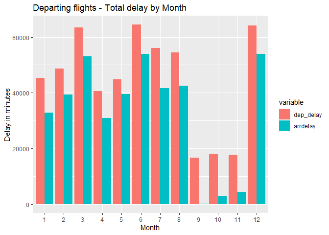

Number of Flights by month. Arrivals and Departure numbers are similar.

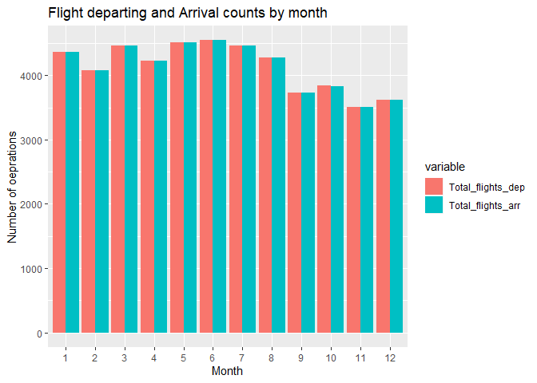

<table>
<tbody>
<tr class="odd">
<td style="text-align: left;">Air traffic hours at Austin Airport</td>
</tr>
</tbody>
</table>

Number of Departures- 49623 Number of Arrivals- 49637

Plot C suggests that there are a lot of late night arrivals. Literally
very few departures post 9 PM

High number of departures are observed between 6AM and 8AM.

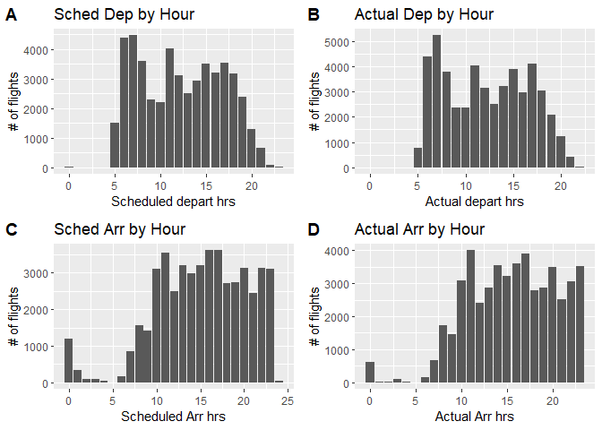

Not much insights across months except for the fact that there is a dip
during the low traffic months - Sep, Oct, Nov. 

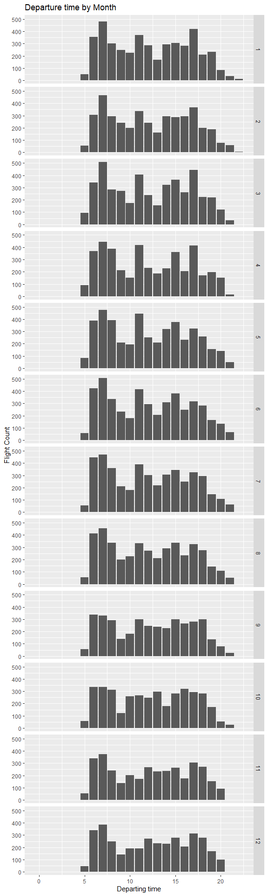

Traffic combining Departures and Arrivals:
------------------------------------------

11 AM to 5PM seems to be the busiest time at Autin Airport. Airtraffic
is really low during early morning hours until 5AM.

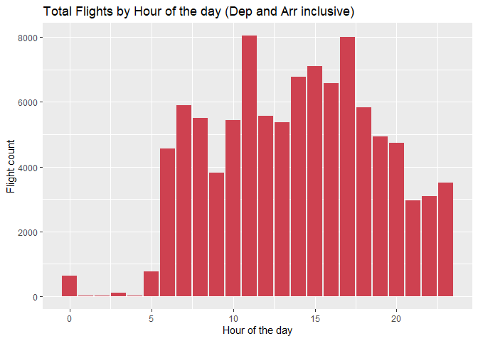

Lets analyse a little on weather delay across months. We think weather
delay combined with tourist activity could be an issue with December.We
are considering only the delays caused in excess of 15 minutes

Both the number and minutes of weather delay peaks during March for
Departures. There is a high weather delay count in the month of December
for Arrivals ONLY, which could may imply the delays are not caused at
Austin airport !!!

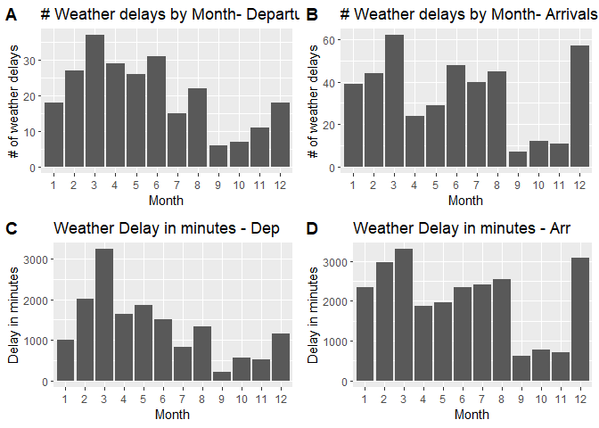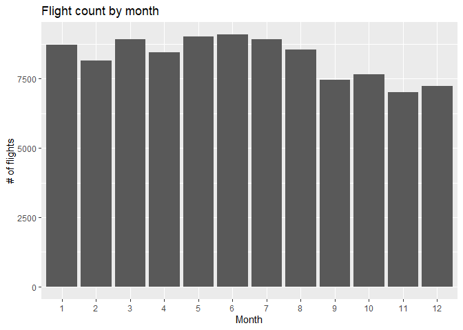

**Portfolio Modeling**
----------------------

### **Problem**

In this problem, we will construct three different portfolios of
exchange-traded funds, or ETFs, and use bootstrap resampling to analyze
the short-term tail risk of our portfolios.

We selected the ETFs ensuring diversity and different levels of risk.

The Ivesco QQQ trust is one of the largest, owns only non-financial
stocks and is tech-heavy. The stock had performed well in 2017 but had a
poor return in 2018.

SPY is one of the safest and largest ETFs around.

ProShares VIX Short-Term Futures ETF (SVXY) is a high risk ETF. This is
an unusual ETF since the performance is dependent on the market
volatility, not security.

ProShares UltraShort FTSE Europe (EPV) is a low performing ETF for the
past few years. iShares Core Growth Allocation ETF (AOR) is a very
diverse ETF.

In total, we have selected 6 ETFs - “QQQ”, “SPY”, “SVXY”, “EPV”, “AOR”
and “YYY”. We have considered 5 years of ETF data starting from
01-Jan-2014.

Sample Data for YYY

    ##            YYY.Open YYY.High  YYY.Low YYY.Close YYY.Volume YYY.Adjusted
    ## 2014-01-02 13.96358 13.96358 13.88534  13.89738      19600     13.89737
    ## 2014-01-03 13.98766 13.98766 13.81913  13.92145      15900     13.92145
    ## 2014-01-06 13.89136 13.93349 13.87932  13.93349       9800     13.93349
    ## 2014-01-07 13.93349 14.03581 13.93349  14.03581      10700     14.03581
    ## 2014-01-08 14.02377 14.02377 13.95756  13.97562      10400     13.97563
    ## 2014-01-09 13.93951 13.98766 13.93349  13.98766      13500     13.98766

Lets look at how the stocks are performing relative to each other. We
can see a strong correlation here. But it is complex and non-linear. As
discussed above, a few are performing well, others are not.

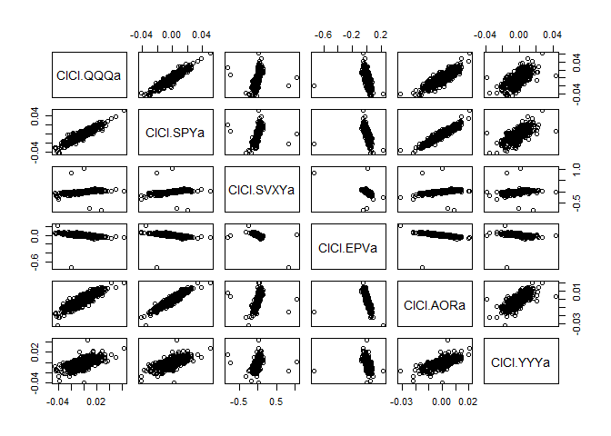

Volatility of the ETFs across the 5 year period.

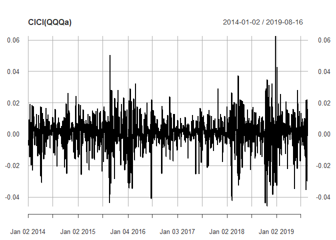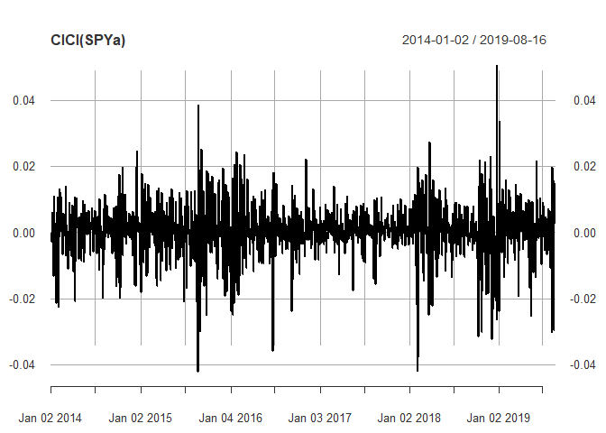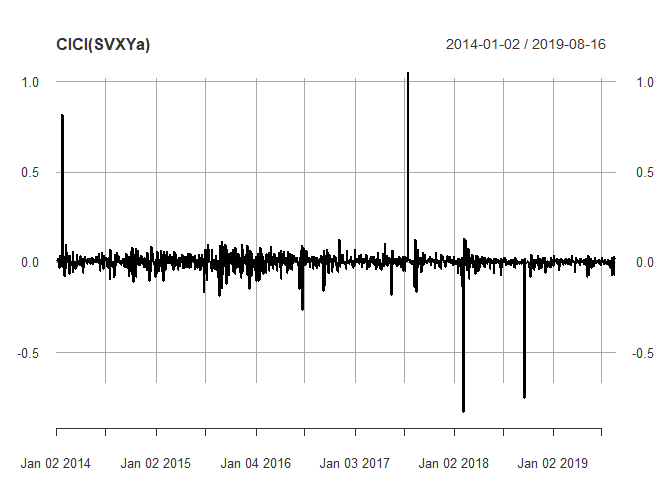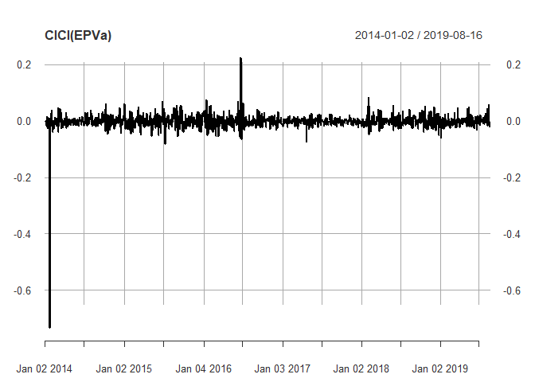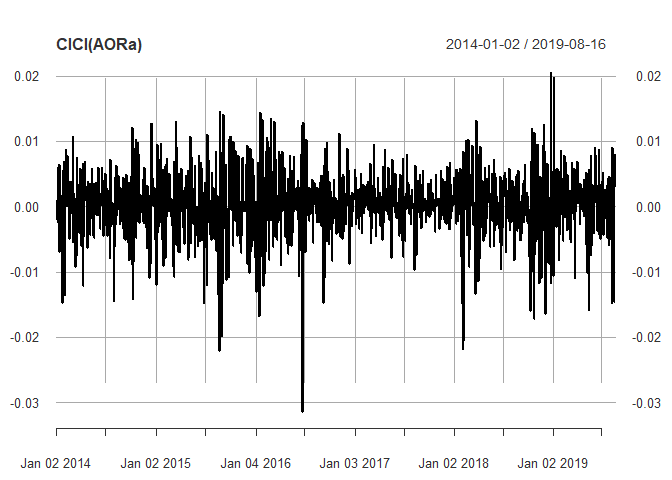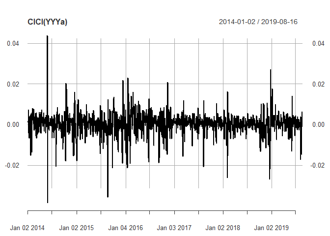

Our initial wealth is $100,000

SIMULATION 1 : SAFE Portfolio

ETFs: “QQQ”, “SPY”, “SVXY”, “EPV”, “AOR”, “YYY”

For the safe portfolio, we distributed 90% of the total wealth among the
high performing ETFs - QQQ, SPY and AOR.

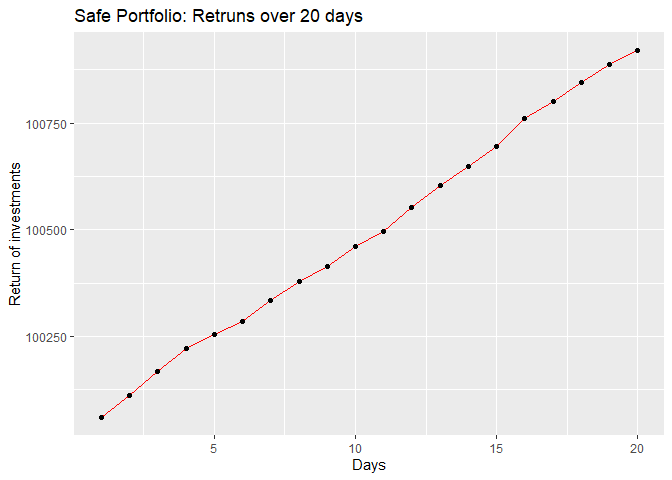

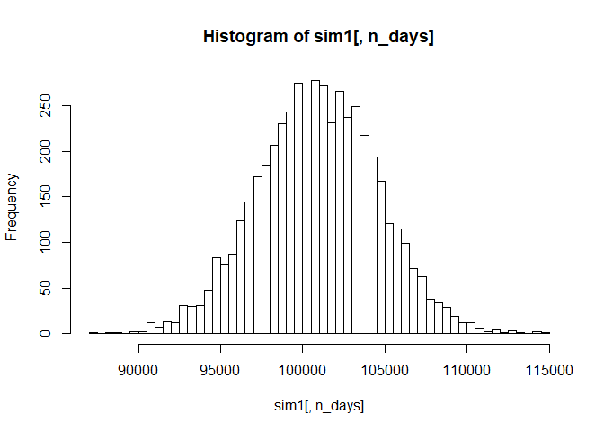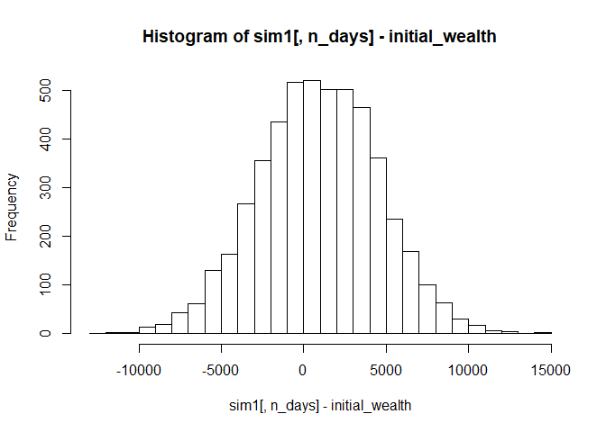

    ## Confidence Interval from Bootstrap Distribution (5000 replicates)

    ## 
    ## Average return of investement after 20 days 100919.1

    ## 
    ## 5% Value at Risk for safe portfolio- -5078.728

SIMULATION 2 : HIGH RISK PORTFOLIO

For the high risk portfolio, we distributed 90% of the total wealth
among the low performing ETFs - SVXY, EPV and YYY.

Average return of investement after 20 days - $100724.3  
5% Value at Risk for safe portfolio - $7850.127

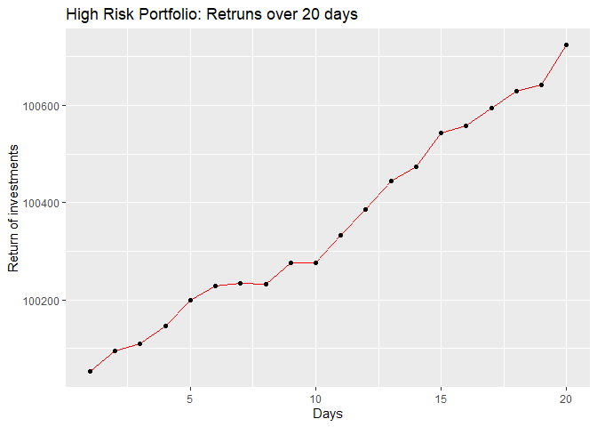

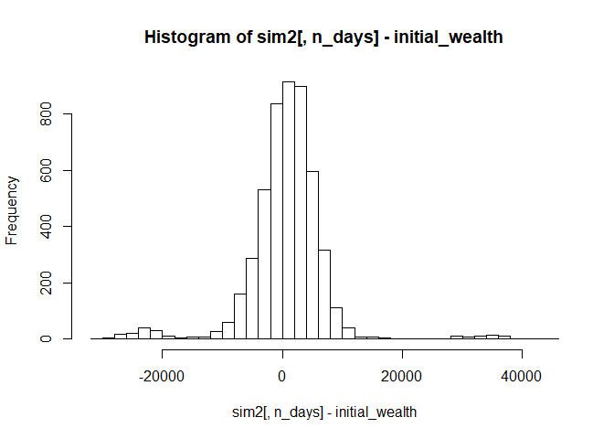

    ## Confidence Interval from Bootstrap Distribution (5000 replicates)

    ## 
    ## Average return of investement after 20 days 100723.2

    ## 
    ## 5% Value at Risk for High portfolio- -7739.601

SIMULATION 3 - With equal weights for high risk and low risk

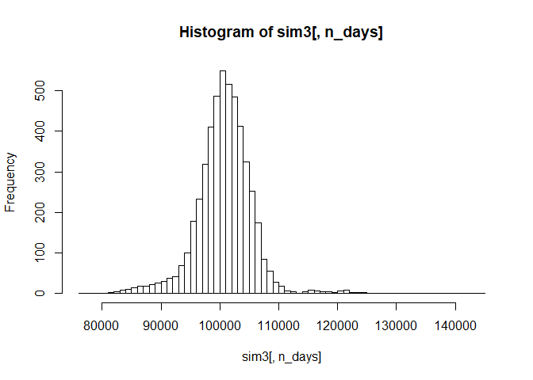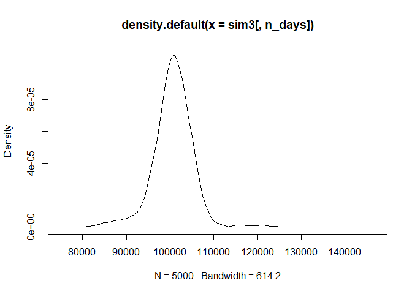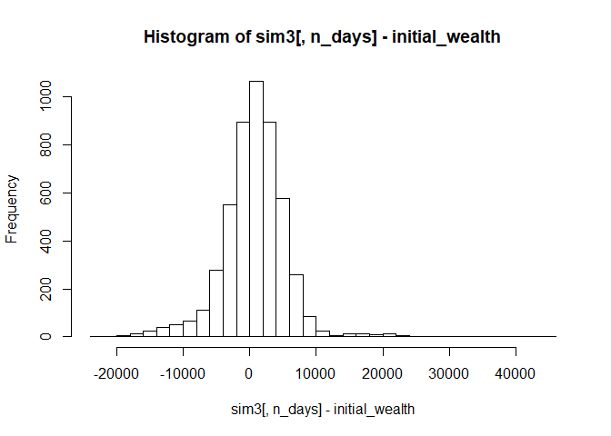

    ## Confidence Interval from Bootstrap Distribution (5000 replicates)

    ## 
    ## Average return of investement after 20 days 100715.4

    ## 
    ## 5% Value at Risk for High portfolio- -6767.904

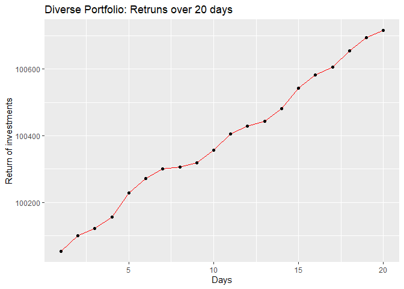

#### **Summary**

For the safe portfolio, we are observing the maximum return of
investment and the lowest 5% VaR. As the portfolio risk increases, we
are able to witness the decrease in returns and increase in VaR value as
expected.

References:
<a href="https://www.bankrate.com/investing/best-etfs/" class="uri">https://www.bankrate.com/investing/best-etfs/</a>
<a href="https://etfdb.com/compare/lowest-ytd-returns/" class="uri">https://etfdb.com/compare/lowest-ytd-returns/</a>

**Market segmentation**
-----------------------

### **Problem**

The data collected in the course of a market-research study using
followers of the Twitter account of a large consumer brand that shall
remain nameless—let’s call it “NutrientH20” just to have a label. The
goal here was for NutrientH20 to understand its social-media audience a
little bit better, so that it could hone its messaging a little more
sharply. Each row of the data represents one user, labeled by a random
(anonymous, unique) 9-digit alphanumeric code. Each column represents an
interest, which are labeled along the top of the data file. The entries
are the number of posts by a given user that fell into the given
category.

> The task is to analyze this data as you see fit, and to prepare a
> concise report for NutrientH20 that identifies any interesting market
> segments that appear to stand out in their social-media audience.

### **Steps taken**

-   K-means with the raw data
-   K-means with k-means++ initialization
-   K-means with k-means++ initialization using PCA data
-   Hierarchial clustering using PCA data

> Note: I have tried different number of clusters and variables and
> decided to use five clusters and have removed five variables including
> spam, chatter and adult

#### **Correlation plot**

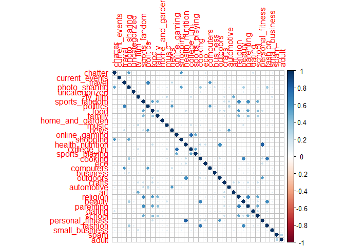

A lot of variables are correlated with each other. For instance,
personal fitness and health nutrition are highly correlated. Also,
online gaming and college university variables have a high correlation.
Let’s use PCA to reduce the dimensions to create fewer number of
uncorrelated variables.

#### **Principal Component Analysis**

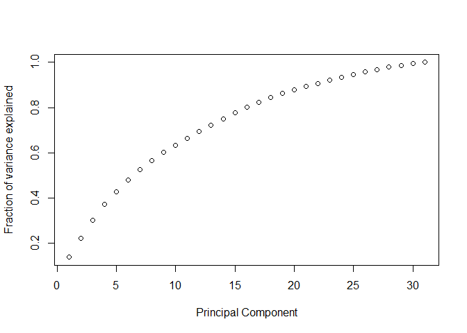

    cumsum(pca_var1)[10]

    ## [1] 0.6337156

At 10th PC, around 63.37% of the variation is explained. According to
Kaiser criterion, we should drop all the principal components with eigen
values less than 1.0. Hence, let’s pick 10 principal components.

#### **K-Means**

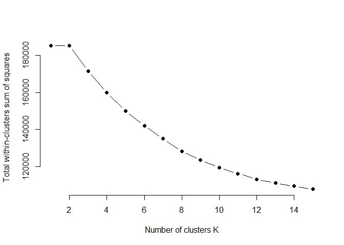

It is difficult to find the number of clusters from the plot as the
within SS decreases with number of clusters. With a lot of trial and
error, I have decided to use 5 cluster since it is easier to intrepret
and identify market segments. Let’s also look at the where our points
are using 5 clusters.

#### **Cluster visualization**

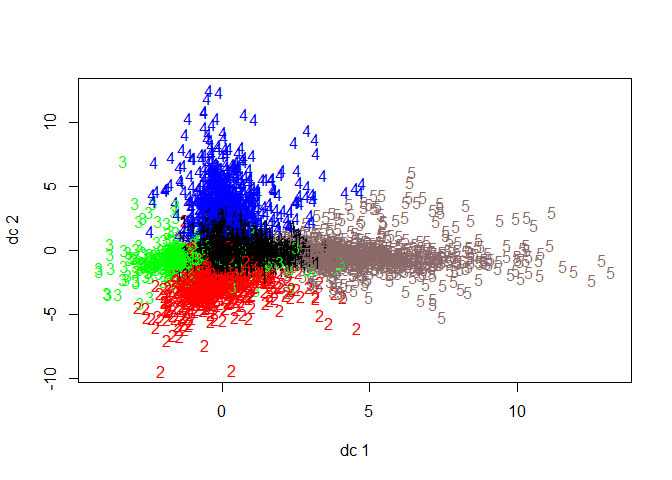

The clusters look well separated. Let’s identify the characteristics of
the clusters.

#### **Results**

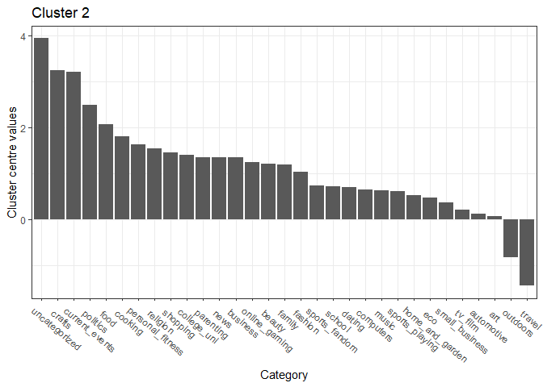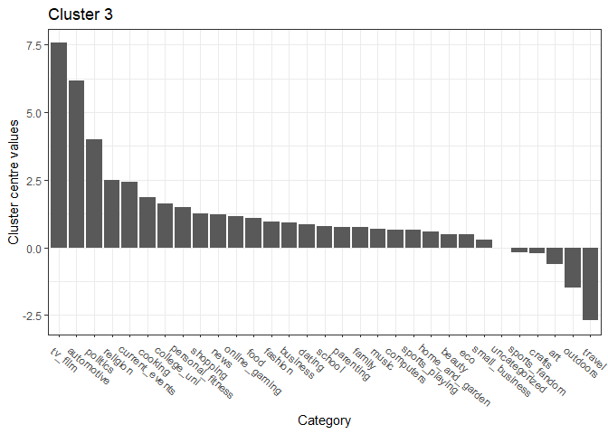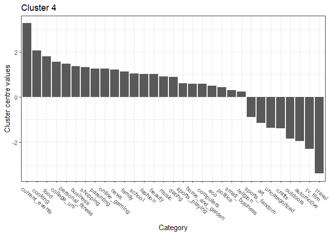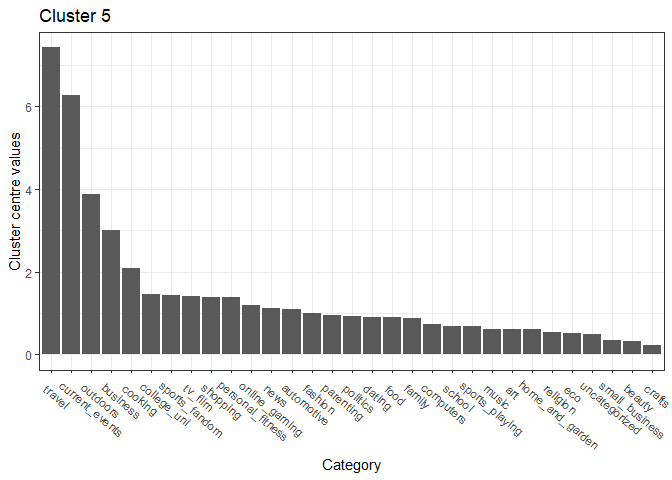

**Market segments identified** 1. Sports Fandom, Travel, Cooking 2.
Crafts, Current Events 3. TV Film, Automotive, Politics 4. Cooking,
Personal Fitness, Food, Shopping, Fashion 5. Travel, Outdoors, Business

Based on the K-Means clustering, we can identify distinct market
segments that NutrientH20 can potentially leverage to design specific
marketing campaigns. For example, Cluster 4 - “Cooking, Personal
Fitness, Food, Shopping, Fashion” and Cluster 5 - “Travel, Outdoors,
Business” differ vastly in terms of interests. Cluster 5 consists mainly
of people who love travelling and people in Cluster 4 are more focused
on personal grooming. Furthermore,Cluster in 1 is primarily composed of
people who have a penchant for sports, travel and cooking. In contrast,
cluster 2 has people who are artistic (they prefer crafts!). Cluster 3
seems like people with eclectic interests - starting from movies to
automotive to politics and religion as well!

#### **Hierarchial Clustering**

#### **Results**

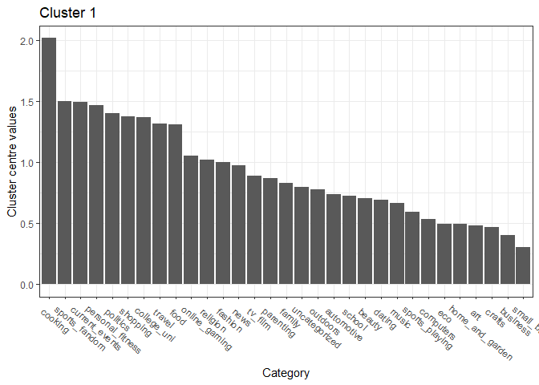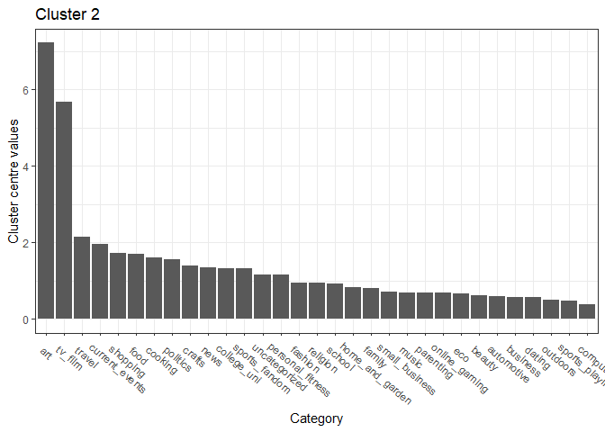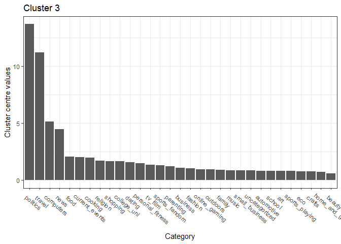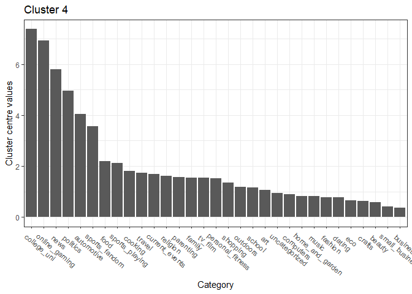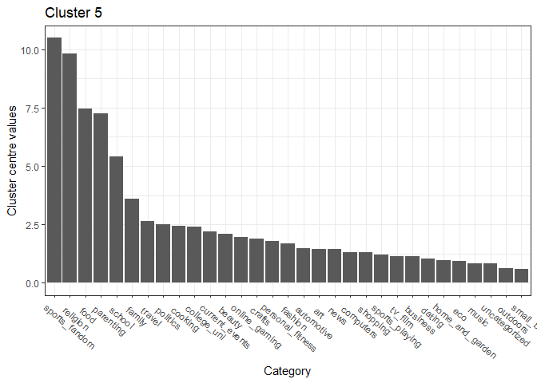

**Market segments identified:** 1. Cooking, Personal Fitness 2. Art, TV
Film, Shopping 3. Politics, Travel, Computers 4. College Universities,
Online Gaming, News 5. Religion, Food, Parenting, School, Family

Hierarchial Clustering reveals some interesting segments that differ by
demographics. Intuitively, Cluster 4 - “College Universities, Online
Gaming, News” will consist of a younger population as compared to
Cluster 5 - “Religion, Food, Parenting, School, Family”. NutrientH20 can
design demographic specific marketing campaigns to get the most
effective message across to their audience. Cluster 2 has a group of
people who have artsy interests - art, tv film and travel. They sure do
know how to enjoy life Cluster 3 has the computer lovers, who also have
an interest for politics and travel.

Market segmentation allows us to derive insights that will help
send the right message to the right group of people that will maximize
the profits of the company and help build better relationships with the
audience. Another point to note is that the cluster stability needs to
be tracked over time since users move in and out of segments as their
interests change.

**Author attribution**
----------------------

### **Problem**

Predicting the authorship of the articles in the C50test directory using
a model trained using the c50train directory in the Reuters C50 Corpus.
Describe the pre-processing and analysis pipeline in detail

##### **0.Loading packages**

##### *Loading the required packages for text analysis*

##### **1. Reading files, Pre-processing and Tokenization**

##### *1.a.Reading files*

    #Reading all folders
    train=Sys.glob('C:/Users/Sahana/Documents/Predictive Models/ARM/ReutersC50/C50train/*')

    #Creating training dataset
    comb_art=NULL
    labels=NULL

    for (name in train)
    { 
      author=substring(name,first=50)#first= ; ensure less than string length
      article=Sys.glob(paste0(name,'/*.txt'))
      comb_art=append(comb_art,article)
      labels=append(labels,rep(author,length(article)))
    }

    #Cleaning the file names
    readerPlain <- function(fname)
      {
                    readPlain(elem=list(content=readLines(fname)), 
                                id=fname, language='en') 
      }

    comb = lapply(comb_art, readerPlain) 
    names(comb) = comb_art
    names(comb) = sub('.txt', '', names(comb))

    #Create a text mining corpus
    corp_tr=Corpus(VectorSource(comb))

##### *1.b. Pre-processing and tokenization:*

##### *- Convert alphabet to lower cases*

##### *- Removing numbers*

##### *- Removing punctuation*

##### *- Removing excess space*

##### *- Removing stop words*

    ## <<DocumentTermMatrix (documents: 2500, terms: 32571)>>
    ## Non-/sparse entries: 540361/80887139
    ## Sparsity           : 99%
    ## Maximal term length: 49
    ## Weighting          : term frequency (tf)

    ## <<DocumentTermMatrix (documents: 2500, terms: 3394)>>
    ## Non-/sparse entries: 382971/8102029
    ## Sparsity           : 95%
    ## Maximal term length: 49
    ## Weighting          : term frequency - inverse document frequency (normalized) (tf-idf)

##### **2. Repeating (1) for the test directories**

##### *2.a.Reading files*

    test=Sys.glob('C:/Users/Sahana/Documents/Predictive Models/ARM/ReutersC50/C50test/*')

    comb_art1=NULL
    labels1=NULL

    for (name in test)
    { 
      author1=substring(name,first=50)#first= ; ensure less than string length
      article1=Sys.glob(paste0(name,'/*.txt'))
      comb_art1=append(comb_art1,article1)
      labels1=append(labels1,rep(author1,length(article1)))
    }

    #Cleaning the file names!!
    comb1 = lapply(comb_art1, readerPlain) 
    names(comb1) = comb_art1
    names(comb1) = sub('.txt', '', names(comb1))

    #Create a text mining corpus
    corp_ts=Corpus(VectorSource(comb1))

##### *2.b.Pre-processing and tokenization*

##### *2.c. Ensuring identical test and train datasets*

    ## <<DocumentTermMatrix (documents: 2500, terms: 3394)>>
    ## Non-/sparse entries: 379314/8105686
    ## Sparsity           : 96%
    ## Maximal term length: 49
    ## Weighting          : term frequency - inverse document frequency (normalized) (tf-idf)

#### **3. Dimensionality reduction**

#### *Principal component analysis is used to (1) extract relevant features from the huge set of variables (2) eliminate the effect of multicollinearity while not losing out on relevant information from the correlated variables*

##### **3.a.Data Preparation for PCA**

#### *- To eliminate 0 entry columns*

    DTM_trr_1<-DTM_trr[,which(colSums(DTM_trr) != 0)] 
    DTM_tss_1<-DTM_tss[,which(colSums(DTM_tss) != 0)]

#### *- To use only the intersecting columns*

    #8312500 elements in both. 
    DTM_tss_1 = DTM_tss_1[,intersect(colnames(DTM_tss_1),colnames(DTM_trr_1))]
    DTM_trr_1 = DTM_trr_1[,intersect(colnames(DTM_tss_1),colnames(DTM_trr_1))]

#### **3.b.Extracting principal components**

    mod_pca = prcomp(DTM_trr_1,scale=TRUE)
    pred_pca=predict(mod_pca,newdata = DTM_tss_1)

#### **3.c.Choosing the right number of principal components**

#### *-Chosen till PC724 - almost 75% of variance explained*

    #Until PC724 - 74.5, almost 75% of variance explained. Hence stopping at 724 out of 2500 principal components
    plot(mod_pca,type='line') 

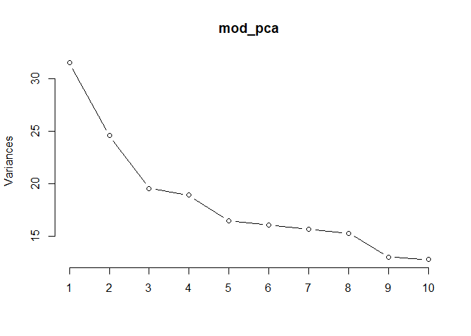

    var <- apply(mod_pca$x, 2, var)  
    prop <- var / sum(var)
    #cumsum(prop)
    plot(cumsum(mod_pca$sdev^2/sum(mod_pca$sdev^2)))

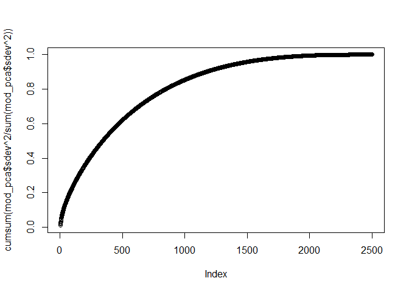

#### **Preparation of the dataset to be used for all the following classification purposes**

#### *-The dataset hopefully contains only the relevant and informational features for classifying the documents to the author rightly*

    tr_class = data.frame(mod_pca$x[,1:724])
    tr_class['author']=labels
    tr_load = mod_pca$rotation[,1:724]

    ts_class_pre <- scale(DTM_tss_1) %*% tr_load
    ts_class <- as.data.frame(ts_class_pre)
    ts_class['author']=labels1

#### **4. Classification techniques to attribute the documents to its authors**

#### **(A) Random Forest Technique**

#### *A.1.Technique*

#### *A.2. Computing accuracy*

#### *-1873 documents have their authors rightly classified; which provides an accuracy/classification rate of 74.9%*

    pre_rand<-predict(mod_rand,data=ts_class)

    tab_rand<-as.data.frame(table(pre_rand,as.factor(ts_class$author)))
    predicted<-pre_rand
    actual<-as.factor(ts_class$author)
    temp<-as.data.frame(cbind(actual,predicted))
    temp$flag<-ifelse(temp$actual==temp$predicted,1,0)
    sum(temp$flag)

    ## [1] 1911

    sum(temp$flag)*100/nrow(temp)

    ## [1] 76.44

#### **(B) Naive Baye’s**

#### *B.1.Model training and prediction on test set*

    library('e1071')
    mod_naive=naiveBayes(as.factor(author)~.,data=tr_class)
    pred_naive=predict(mod_naive,ts_class)

    ## Warning in data.matrix(newdata): NAs introduced by coercion

#### *B.2.Classification accuracy obtained*

#### *-810 documents have their authors rightly classified; which provides an accuracy/classification rate of 32.4%*

    library(caret)

    predicted_nb=pred_naive
    actual_nb=as.factor(ts_class$author)

    temp_nb<-as.data.frame(cbind(actual_nb,predicted_nb))
    temp_nb$flag<-ifelse(temp_nb$actual_nb==temp_nb$predicted_nb,1,0)
    sum(temp_nb$flag)

    ## [1] 812

    sum(temp_nb$flag)*100/nrow(temp_nb)

    ## [1] 32.48

    #32.4%

#### \*B.3.Comparing train and test accuracy\*\*

#### \*\*(C) K Nearest Neighbors

#### *C.1.Preparation of dataset*

    train.X = subset(tr_class, select = -c(author))
    test.X = subset(ts_class,select=-c(author))
    train.author=as.factor(tr_class$author)
    test.author=as.factor(ts_class$author)

#### *C.2.KNN method*

#### *-32.08% is the classification/accuracy rate obtained from KNN method, with a k-choice of 1. i.e., 802 documents rightly classified*

    library(class)
    set.seed(1)
    knn_pred=knn(train.X,test.X,train.author,k=1)

    temp_knn=as.data.frame(cbind(knn_pred,test.author))
    temp_knn_flag<-ifelse(as.integer(knn_pred)==as.integer(test.author),1,0)
    sum(temp_knn_flag)

    ## [1] 838

    sum(temp_knn_flag)*100/nrow(temp_knn) #802

    ## [1] 33.52

    #32.08% accuracy

#### *-4 different classification techniques were used to predict the author for the documents. The comparison of their results are as follows:*

#### *-Random forest provides the best accuracy out of the three methods, with a 74%. The other two methods provide drastically lower accuracies around 32%*

#### *-Multinomial logistic regression and other tree based methods can also be used for the attribution. But we have chosen 3 for this exercise*

    library(ggplot2)
    comp<-data.frame("Model"=c("Random Forest","Naive Baye's","KNN"), "Test.accuracy"=c(74.9,32.4,32.08))
    comp

    ##           Model Test.accuracy
    ## 1 Random Forest         74.90
    ## 2  Naive Baye's         32.40
    ## 3           KNN         32.08

    ggplot(comp,aes(x=Model,y=Test.accuracy))+geom_col()

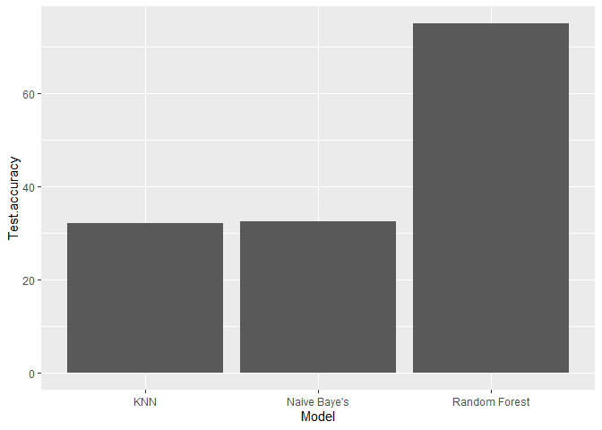

**Association rule mining**
---------------------------

### **Problem**

We have multiple shopping baskets of grocery purchases and we will find
some interesting association rules between then using rule mining.

#### Presenting the structure of the raw dataset:

    ## [1] "citrus fruit,semi-finished bread,margarine,ready soups"             
    ## [2] "tropical fruit,yogurt,coffee"                                       
    ## [3] "whole milk"                                                         
    ## [4] "pip fruit,yogurt,cream cheese ,meat spreads"                        
    ## [5] "other vegetables,whole milk,condensed milk,long life bakery product"
    ## [6] "whole milk,butter,yogurt,rice,abrasive cleaner"

We transform the data into a “transactions” class before applying the
apriori algorithm. The summary of the dataset reveals the following: 1.
There are total of 9835 transactions in our dataset 2. Whole milk is the
present in 2513 baskets and is the most frequently bought item 3. More
than half of the transactions have 4 or lesser items per basket

#### **Let’s explore rules with support &gt; 0.05, confidence &gt; 0.1 and length &lt;= 2 using the ‘apriori’ algorithm**

There are only 6 rules generated because of the high support and low
confidence level. We also notice that most relationships in this item
set include whole milk, yogurt and rolls/buns which is in accordance
with the transaction frequency plot we saw earlier. These are some of
the most frequently bought items.

    ##     lhs                   rhs                support    confidence
    ## [1] {yogurt}           => {whole milk}       0.05602440 0.4016035 
    ## [2] {whole milk}       => {yogurt}           0.05602440 0.2192598 
    ## [3] {rolls/buns}       => {whole milk}       0.05663447 0.3079049 
    ## [4] {whole milk}       => {rolls/buns}       0.05663447 0.2216474 
    ## [5] {other vegetables} => {whole milk}       0.07483477 0.3867578 
    ## [6] {whole milk}       => {other vegetables} 0.07483477 0.2928770 
    ##     lift     count
    ## [1] 1.571735 551  
    ## [2] 1.571735 551  
    ## [3] 1.205032 557  
    ## [4] 1.205032 557  
    ## [5] 1.513634 736  
    ## [6] 1.513634 736

#### **Let’s decrease support further and increase confidence slightly with support &gt; 0.02, confidence &gt; 0.2 and length &lt;= 2**

This item set contains 72 rules and includes a lot more items. However,
whole milk still seems to be a common occurence.

#### **Let us increase the confidence level and decrease the support further. Let’s explore rules with support &gt; 0.0015, confidence &gt; 0.8 and length &lt;= 2**

#### **Summary**

From the association rules, some of the conclusions that can be drawn
are: 
1. People are more likely to buy bottled beer if they purchased red
wine or liquor 
2. People are more likely to buy vegetables when they buy
vegetable/fruit juice 
3. Whole milk is the most common item purchased by
customers
