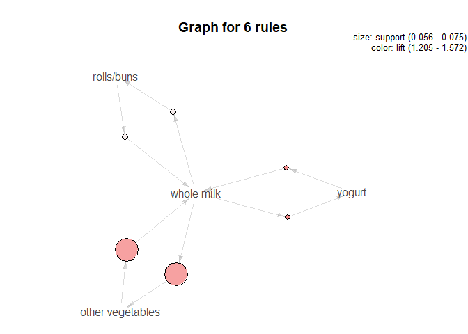
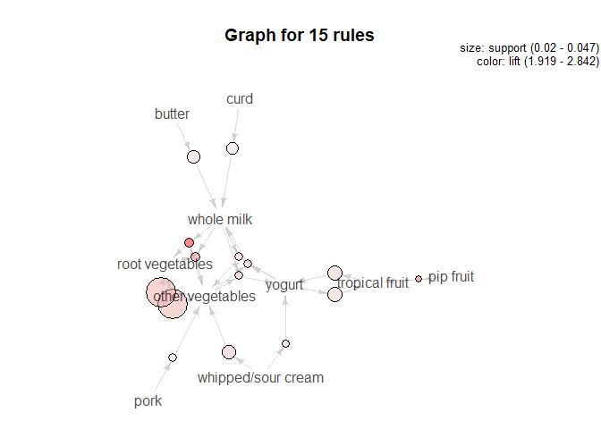
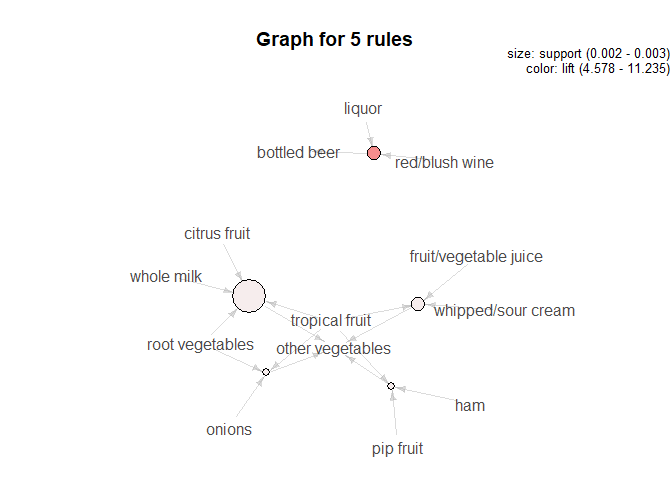

**Association rule mining**
---------------------------

### **Problem**

We have multiple shopping baskets of grocery purchases and we will find
some interesting association rules between then using rule mining.

#### Presenting the structure of the raw dataset:

    ## [1] "citrus fruit,semi-finished bread,margarine,ready soups"             
    ## [2] "tropical fruit,yogurt,coffee"                                       
    ## [3] "whole milk"                                                         
    ## [4] "pip fruit,yogurt,cream cheese ,meat spreads"                        
    ## [5] "other vegetables,whole milk,condensed milk,long life bakery product"
    ## [6] "whole milk,butter,yogurt,rice,abrasive cleaner"

We transform the data into a “transactions” class before applying the
apriori algorithm. The summary of the dataset reveals the following: 1.
There are total of 9835 transactions in our dataset 2. Whole milk is the
present in 2513 baskets and is the most frequently bought item 3. More
than half of the transactions have 4 or lesser items per basket

#### **Let’s explore rules with support &gt; 0.05, confidence &gt; 0.1 and length &lt;= 2 using the ‘apriori’ algorithm**

There are only 6 rules generated because of the high support and low
confidence level. We also notice that most relationships in this item
set include whole milk, yogurt and rolls/buns which is in accordance
with the transaction frequency plot we saw earlier. These are some of
the most frequently bought items.

    ##     lhs                   rhs                support    confidence
    ## [1] {yogurt}           => {whole milk}       0.05602440 0.4016035 
    ## [2] {whole milk}       => {yogurt}           0.05602440 0.2192598 
    ## [3] {rolls/buns}       => {whole milk}       0.05663447 0.3079049 
    ## [4] {whole milk}       => {rolls/buns}       0.05663447 0.2216474 
    ## [5] {other vegetables} => {whole milk}       0.07483477 0.3867578 
    ## [6] {whole milk}       => {other vegetables} 0.07483477 0.2928770 
    ##     lift     count
    ## [1] 1.571735 551  
    ## [2] 1.571735 551  
    ## [3] 1.205032 557  
    ## [4] 1.205032 557  
    ## [5] 1.513634 736  
    ## [6] 1.513634 736

#### **Let’s decrease support further and increase confidence slightly with support &gt; 0.02, confidence &gt; 0.2 and length &lt;= 2**

This item set contains 72 rules and includes a lot more items. However,
whole milk still seems to be a common occurence.

#### **Let us increase the confidence level and decrease the support further. Let’s explore rules with support &gt; 0.0015, confidence &gt; 0.8 and length &lt;= 2**

#### **Summary**

From the association rules, some of the conclusions that can be drawn
are: 
1. People are more likely to buy bottled beer if they purchased red
wine or liquor 
2. People are more likely to buy vegetables when they buy
vegetable/fruit juice 
3. Whole milk is the most common item purchased by
customers
